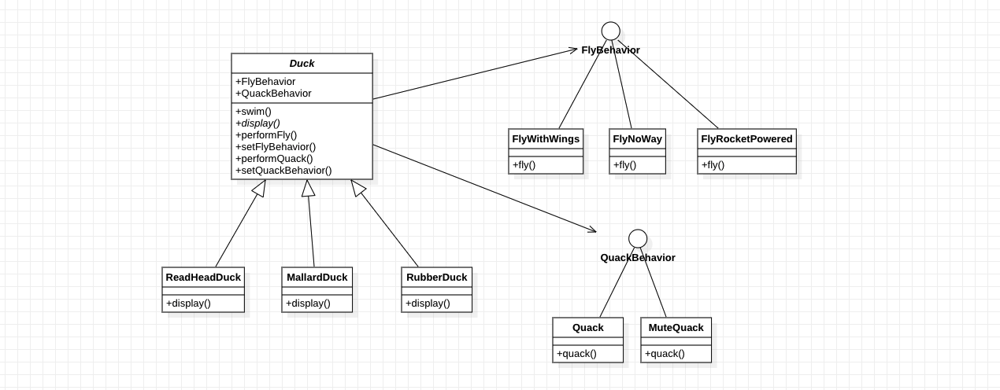
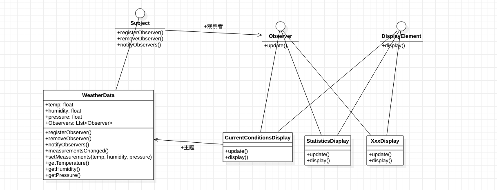
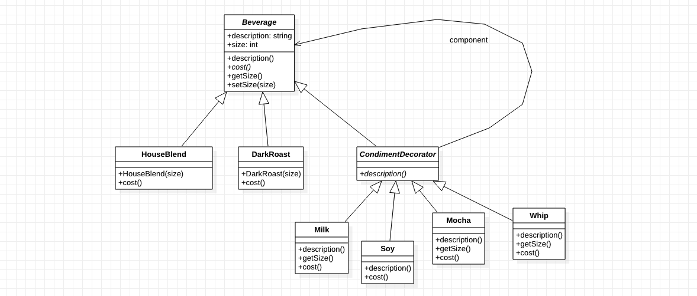

# 设计模式练习

模式是在某情境（context）下，针对某问题的某种解决方案。

## 设计原则

* 封装变化

    找出应用中可能需要变化之处，把它们独立出来，不要和那些不需要变化的代码混在一起

* 针对接口编程，而不是针对实现编程

* 多用组合，少用继承

* 为交互对象之间的松耦合设计而努力

* 类应该对扩展开放，对修改关闭

---
## 策略模式（StrategyPattern）

**定义：定义了算法族，分别封装起来，让他们之间可以互相替换，此模式让算法的变化独立于使用算法的客户。**

**[示例](strategy-pattern)** 

---
## 观察者模式（ObserverPattern）

**定义：定义了对象之间一对多依赖，这样一来，当一个对象改变状态时，所有依赖它的对象都会受到通知并自动更新。**

**[示例](observer-pattern)**

---
## 装饰者模式（DecoratorPattern）

**动态地将责任附加到对象上，若要扩展功能，装饰者提供了比继承更有弹性的替代方案。**

**[示例](decorator-pattern)**

---
## 状态模式（StatePattern）

**定义：允许对象在内部状态改变时改变它的行为，对象看起来好像修改了它的类。**

**[示例](state-pattern)** 

---
## 代理模式（ProxyPattern）

**定义：由于某些原因需要给某对象提供一个代理以控制对该对象的访问。这时，访问对象不适合或者不能直接引用目标对象，代理对象作为访问对象和目标对象之间的中介。**

**[示例](proxy-pattern)** 

---
## 混合模式（CompoundPattern）

**定义：两种或两种以上的模式组合，以解决问题。示例中使用了：抽象工厂模式、装饰者模式、迭代器模式、观察者模式、组合模式。## 混合模式（CompoundPattern）**

**[示例](compound-pattern)** 
